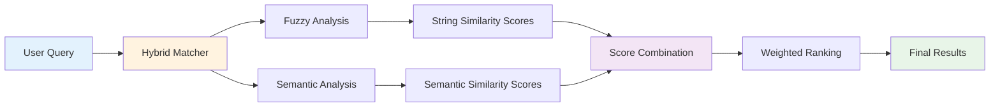

# RepoMap Tool

*A Tool to Help AI Assistants Navigate and Understand Codebases*

[](https://github.com/{username}/repomap-tool/actions?query=workflow%3ACI)
[](https://github.com/{username}/repomap-tool/actions?query=workflow%3A%22Docker+Build%22)
[](https://github.com/{username}/repomap-tool/actions?query=workflow%3ARelease)
[](https://github.com/{username}/repomap-tool/actions?query=workflow%3A%22Nightly+Build%22)

> "Code archaeology isn't just about finding what works, but understanding why it was written that way in the first place." 
> `James Wilson`


## Overview


**Why?** AI code assistants struggle with large codebases. They often miss context, can't find related code when names don't match exactly, and waste precious context window space searching for the right files. This leads to inaccurate suggestions and inefficient code generation.

**What?** RepoMap Tool is an intelligent code analysis engine that supercharges AI code assistants by providing comprehensive codebase understanding. Built with tree-sitter for accurate code parsing, it combines fuzzy matching (finding similar names) with semantic analysis (understanding meaning) to give AI assistants the context they need for accurate code suggestions.

**How?** It analyzes your codebase structure, maps relationships between files and functions, and provides AI assistants with intelligent search capabilities to discover and understand the code they need to work with effectively.


## Table of Contents

- [RepoMap Tool (Inspired by Aider)](#repomap-tool-inspired-by-aider)
  - [Overview](#overview)
  - [Table of Contents](#table-of-contents)
  - [The Problem](#the-problem)
  - [The Solution](#the-solution)
    - [🔍 **Fuzzy Matching**](#-fuzzy-matching)
    - [🧠 **Semantic Analysis**](#-semantic-analysis)
    - [⚡ **Hybrid Approach**](#-hybrid-approach)
  - [Real-World Scenarios](#real-world-scenarios)
    - [Scenario 1: AI Assistant Finding Authentication Code](#scenario-1-ai-assistant-finding-authentication-code)
    - [Scenario 2: AI Assistant Understanding Data Flow](#scenario-2-ai-assistant-understanding-data-flow)
    - [Scenario 3: AI Assistant Planning Refactoring](#scenario-3-ai-assistant-planning-refactoring)
  - [Getting Started](#getting-started)
    - [Quick Start with Docker](#quick-start-with-docker)
    - [Basic Usage Examples](#basic-usage-examples)
    - [Docker Images](#docker-images)
  - [Key Benefits for AI Code Assistants](#key-benefits-for-ai-code-assistants)
    - [🧠 **Enhanced Context Understanding**](#-enhanced-context-understanding)
    - [🔍 **Intelligent Code Discovery**](#-intelligent-code-discovery)
    - [🎯 **Precise Code Location**](#-precise-code-location)
    - [🔗 **Dependency Awareness**](#-dependency-awareness)
    - [📊 **Code Quality Intelligence**](#-code-quality-intelligence)
    - [⚡ **Faster AI Response Times**](#-faster-ai-response-times)
  - [When to Use RepoMap Tool](#when-to-use-repomap-tool)
    - [Perfect for:](#perfect-for)
    - [Use Cases:](#use-cases)
  - [Search Strategies](#search-strategies)
    - [Fuzzy Matching](#fuzzy-matching)
    - [Semantic Matching](#semantic-matching)
    - [Hybrid Matching](#hybrid-matching)
  - [Project Analysis](#project-analysis)
  - [Getting Help](#getting-help)
  - [Code Quality \& DI Linting](#code-quality--di-linting)
  - [Contributing](#contributing)
  - [License](#license)


## The Problem

When AI code assistants work with large codebases, they face these critical challenges:

- **Context window limitations**: AI assistants waste precious tokens searching for relevant code
- **Naming variations**: AI can't find code when the same concept is named `userAuth`, `user_auth`, `UserAuth`, or `authenticate_user`
- **Scattered logic**: AI misses related functionality spread across multiple files with different naming conventions
- **Incomplete context**: AI generates suggestions without understanding the full codebase structure
- **Inefficient searches**: AI spends time on irrelevant files instead of focusing on the most relevant code

## The Solution

RepoMap Tool addresses these AI assistant challenges through:

### 🔍 **Fuzzy Matching**
Enables AI assistants to find code even when names don't match exactly:
- `userAuth` ↔ `user_auth` ↔ `UserAuth`
- `dataProcessor` ↔ `process_data` ↔ `DataProcessor`
- Handles typos, abbreviations, and naming conventions that confuse AI

### 🧠 **Semantic Analysis**
Gives AI assistants understanding of what code does, not just what it's called:
- AI can find authentication logic even if it's named `login`, `signin`, or `verify_credentials`
- AI discovers data processing functions regardless of naming patterns
- AI identifies related functionality across different modules

### ⚡ **Hybrid Approach**
Provides AI assistants with comprehensive search capabilities through parallel analysis:



- **Parallel processing**: Both fuzzy and semantic analysis run simultaneously
- **Score combination**: Results are intelligently merged for optimal coverage
- **Weighted ranking**: Balances string similarity with conceptual understanding
- **Context-aware**: Adapts to your specific codebase patterns

## Real-World Scenarios

### Scenario 1: AI Assistant Finding Authentication Code
**AI needs to understand**: "How does user authentication work in this codebase?"
**Without RepoMap**: AI might miss `login`, `signin`, or `verify_credentials` functions
**With RepoMap**: AI discovers all authentication-related code regardless of naming conventions

### Scenario 2: AI Assistant Understanding Data Flow
**AI needs to understand**: "How does data get processed in this application?"
**Without RepoMap**: AI might only see files with "process" in the name
**With RepoMap**: AI gets a comprehensive view of the entire data pipeline

### Scenario 3: AI Assistant Planning Refactoring
**AI needs to understand**: "What code would be affected if I change the user model?"
**Without RepoMap**: AI might miss hidden dependencies and cause breaking changes
**With RepoMap**: AI can analyze all relationships and dependencies automatically

## Getting Started

### Quick Start with Docker
```bash
# Clone the repository
git clone <repository-url>
cd repomap-tool

# Build and run with Docker
make docker-build

# Analyze your project (with cache persistence)
docker run -v $(pwd)/.repomap:/app/cache -v /path/to/your/project:/workspace ghcr.io/xynova/repomap-tool:latest analyze /workspace

# Search for code (with cache persistence)
docker run -v $(pwd)/.repomap:/app/cache -v /path/to/your/project:/workspace ghcr.io/xynova/repomap-tool:latest search /workspace "user authentication"

# Try it with our example project
docker run -v $(pwd)/.repomap:/app/cache -v $(pwd)/examples/test-project:/workspace ghcr.io/xynova/repomap-tool:latest search /workspace "auth"
```

### Basic Usage Examples

**Try with our example project first:**
```bash
# Search for authentication-related code
docker run -v $(pwd)/.repomap:/app/cache -v $(pwd)/examples/test-project:/workspace ghcr.io/xynova/repomap-tool:latest search /workspace "auth"

# Find specific function names
docker run -v $(pwd)/.repomap:/app/cache -v $(pwd)/examples/test-project:/workspace ghcr.io/xynova/repomap-tool:latest search /workspace "authenticate_user"

# Test fuzzy matching with different naming conventions
docker run -v $(pwd)/.repomap:/app/cache -v $(pwd)/examples/test-project:/workspace ghcr.io/xynova/repomap-tool:latest search /workspace "user_auth"
```

**Now try with your own project:**
```bash
# Find authentication-related code
docker run -v $(pwd)/.repomap:/app/cache -v /path/to/your/project:/workspace ghcr.io/xynova/repomap-tool:latest search /workspace "user login authentication"

# Discover data processing functions
docker run -v $(pwd)/.repomap:/app/cache -v /path/to/your/project:/workspace ghcr.io/xynova/repomap-tool:latest search /workspace "data processing pipeline"

# Find code with similar names
docker run -v $(pwd)/.repomap:/app/cache -v /path/to/your/project:/workspace ghcr.io/xynova/repomap-tool:latest search /workspace "userAuth"

# Get comprehensive results
docker run -v $(pwd)/.repomap:/app/cache -v /path/to/your/project:/workspace ghcr.io/xynova/repomap-tool:latest search /workspace "error handling"
```

### Docker Images

We provide GPU-optimized and CPU-only Docker image variants:

**GPU-Enabled (Default - Recommended):**
```bash
# Latest release with GPU acceleration
docker pull ghcr.io/xynova/repomap-tool:latest
docker pull ghcr.io/xynova/repomap-tool:gpu
```

**CPU-Only (For Constrained Environments):**
```bash
# CPU-only version for environments without GPU
docker pull ghcr.io/xynova/repomap-tool:cpu
```

**Building Images Locally:**
```bash
# Build both GPU and CPU images
./scripts/build-docker.sh both

# Build only GPU image (default)
./scripts/build-docker.sh gpu

# Build only CPU image
./scripts/build-docker.sh cpu
```

**Using Pre-built Images:**

**GPU Environments (Default):**
```bash
# Use GPU acceleration (requires NVIDIA GPU with CUDA)
docker run --rm -t --gpus all -v $(pwd):/workspace repomap-tool:latest explore find "authentication"

# Apple Silicon with MPS acceleration
docker run --rm -t -v $(pwd):/workspace repomap-tool:latest explore find "authentication"
```

**CPU-Only Environments:**
```bash
# Use CPU-only version (for constrained environments)
docker run --rm -t -v $(pwd):/workspace repomap-tool:cpu explore find "authentication"
```

**Performance Notes:**
- **GPU images** automatically detect and use CUDA (NVIDIA) or MPS (Apple Silicon) when available
- **CPU images** are smaller and work in any environment but are slower for embedding computation
- **Default behavior**: Falls back to CPU if no GPU is detected

## Key Benefits for AI Code Assistants

### 🧠 **Enhanced Context Understanding**
- Provides AI assistants with comprehensive codebase context
- Enables better understanding of relationships between files and functions
- Helps AI generate more accurate and contextually relevant code suggestions

### 🔍 **Intelligent Code Discovery**
- AI assistants can find related code even when names don't match exactly
- Discovers hidden dependencies and connections that might be missed
- Enables AI to suggest improvements based on similar patterns across the codebase

### 🎯 **Precise Code Location**
- Helps AI assistants quickly locate the exact code they need to modify
- Reduces context window waste by finding the most relevant code sections
- Enables more targeted and efficient code generation

### 🔗 **Dependency Awareness**
- AI assistants can understand what code would be affected by changes
- Prevents breaking changes by identifying all related components
- Enables safer refactoring suggestions with full impact analysis

### 📊 **Code Quality Intelligence**
- Provides AI with insights into code complexity and coupling
- Helps AI suggest better architectural patterns and improvements
- Enables more informed decisions about code organization and structure

### ⚡ **Faster AI Response Times**
- Reduces the time AI assistants spend searching for relevant code
- Enables more efficient context gathering and analysis
- Results in quicker, more accurate code suggestions and completions

## When to Use RepoMap Tool

### Perfect for:
- **Large codebases** (100+ files)
- **Legacy systems** with inconsistent naming
- **Team projects** where naming conventions vary
- **Code exploration** and understanding
- **Refactoring preparation** and impact analysis
- **Onboarding** new developers to existing codebases

### Use Cases:
- **"How does this feature work?"** - Understand implementation details
- **"Where is this functionality?"** - Find specific code quickly
- **"What would break if I change this?"** - Analyze dependencies
- **"Is there similar code elsewhere?"** - Find duplicates or alternatives
- **"How is data flowing through this system?"** - Map data pipelines

## Search Strategies

### Fuzzy Matching
Best for finding code when you know part of the name or there are naming variations.

**Example**: Searching for "userAuth" will find:
- `userAuth`
- `user_auth`
- `UserAuth`
- `authenticateUser`
- `userAuthentication`

### Semantic Matching
Best for finding code based on what it does, regardless of naming.

**Example**: Searching for "user authentication" will find:
- Functions that handle login/logout
- Password validation code
- Session management
- Authorization checks
- Security-related utilities

### Hybrid Matching
Best for comprehensive results that combine both approaches.

**Example**: Searching for "data processing" will find:
- Functions with "process" in the name (fuzzy)
- Functions that transform or manipulate data (semantic)
- Related utilities and helpers
- Pipeline components

## Project Analysis

RepoMap Tool doesn't just search - it analyzes your entire codebase to understand:

- **File relationships**: Which files import or depend on others
- **Function connections**: How functions call each other
- **Data flow**: How data moves through your application
- **Code complexity**: Which parts are most complex or tightly coupled
- **Architecture patterns**: How your code is organized

This analysis enables more intelligent searching and provides insights into your codebase structure.

## Getting Help

- **Documentation**: [CLI Reference](docs/CLI_GUIDE.md)
- **Examples**: Check the `examples/` directory for practical usage
- **Architecture**: [Development Guide](docs/architecture/DEVELOPMENT_GUIDE.md)

## Code Quality & DI Linting

RepoMap-Tool maintains high code quality through comprehensive linting and dependency injection (DI) validation:

- **🔍 DI Linter**: Custom tool that detects DI violations and anti-patterns
- **📋 Code Standards**: Strict Python coding standards with DRY principles
- **🏗️ DI Architecture**: Excellent dependency injection with service factory pattern
- **✅ Quality Gates**: Automated checks in CI/CD pipeline

**Quick Start:**
```bash
# Run all quality checks
make lint

# Run DI linter specifically
python scripts/di_linter.py src/ tests/

# See DI violations
python scripts/di_linter.py src/repomap_tool/cli/utils/console.py
```

**Documentation:**
- [DI Linting Guide](docs/DI_LINTING_GUIDE.md)
- [Python Coding Standards](.cursor/rules/rules-for-python-coding.mdc)
- [DI Architecture Patterns](.cursor/rules/rules-for-python-coding.mdc#dependency-injection-patterns)

## Contributing

We welcome contributions! See our [Development Guide](docs/architecture/DEVELOPMENT_GUIDE.md) for how to get started.

## License

MIT License - feel free to use in your projects.
