# RepoMap-Tool: Technical Architecture

## 🔧 **System Components Overview**

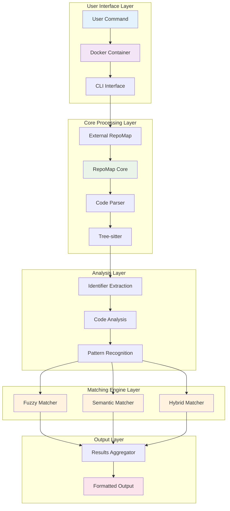

## 🔄 **Detailed Data Flow**

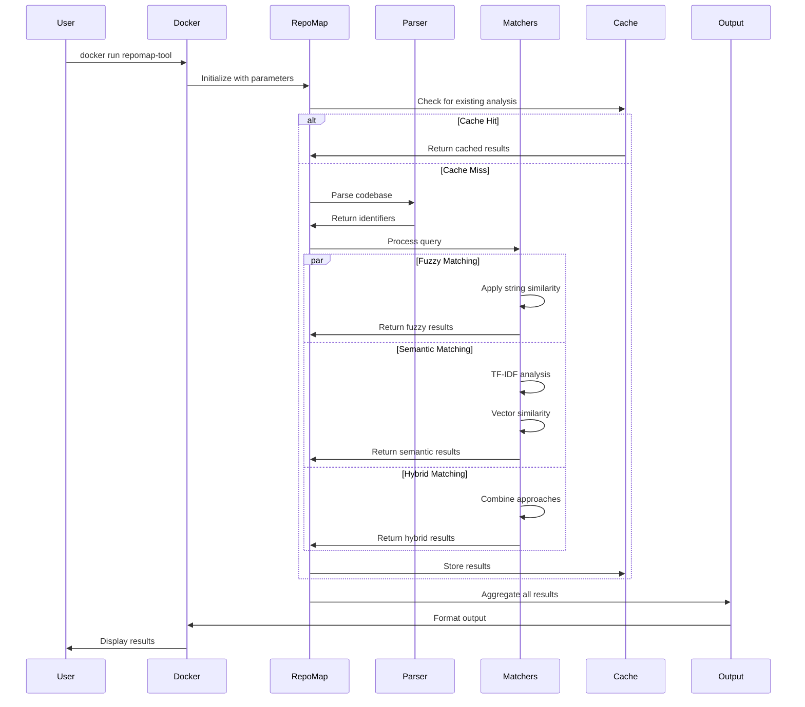

## 🧠 **Matching Algorithm Details**

### **Fuzzy Matching Process**

```mermaid
graph LR
    A[Query: "auth"] --> B[String Normalization]
    B --> C[Multiple Strategies]
    
    C --> D[Prefix Match]
    C --> E[Substring Match]
    C --> F[Levenshtein]
    C --> G[Word Overlap]
    
    D --> H[Score Calculation]
    E --> H
    F --> H
    G --> H
    
    H --> I[Threshold Filter]
    I --> J[Ranked Results]
    
    style A fill:#e3f2fd
    style C fill:#fff3e0
    style J fill:#e8f5e8
```

### **Semantic Matching Process**

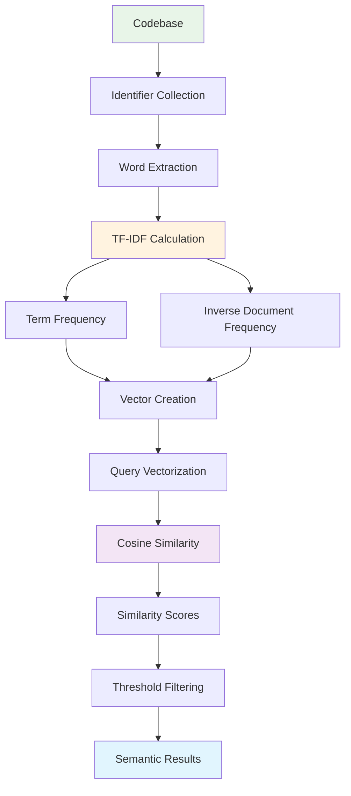

### **Hybrid Matching Process**

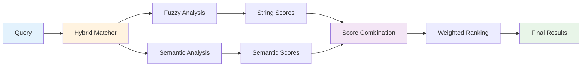

## 🏗️ **Component Architecture**

### **Core Components**

```mermaid
graph TB
    subgraph "DockerRepoMap Class"
        A[__init__] --> B[Initialize Matchers]
        B --> C[Setup RepoMap]
        C --> D[Configure Cache]
    end
    
    subgraph "FuzzyMatcher Class"
        E[__init__] --> F[Set Threshold]
        F --> G[Configure Strategies]
        G --> H[match_identifiers]
    end
    
    subgraph "AdaptiveSemanticMatcher Class"
        I[__init__] --> J[Setup TF-IDF]
        J --> K[learn_from_identifiers]
        K --> L[find_semantic_matches]
    end
    
    subgraph "HybridMatcher Class"
        M[__init__] --> N[Initialize Both]
        N --> O[combine_results]
        O --> P[weighted_ranking]
    end
    
    style A fill:#e3f2fd
    style E fill:#fff3e0
    style I fill:#fff3e0
    style M fill:#fff3e0
```

### **Data Structures**

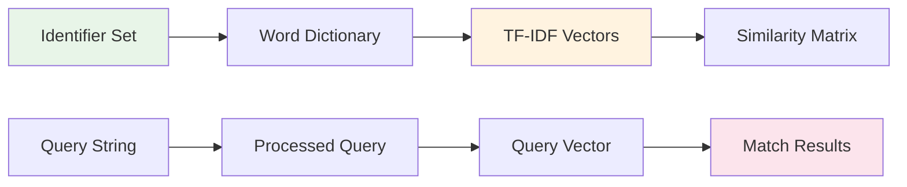

## ⚡ **Performance Characteristics**

### **Time Complexity**

| Operation | Fuzzy | Semantic | Hybrid |
|-----------|-------|----------|--------|
| **Initialization** | O(1) | O(n) | O(n) |
| **Single Query** | O(n) | O(n) | O(n) |
| **Batch Queries** | O(n×m) | O(n×m) | O(n×m) |
| **Cache Lookup** | O(1) | O(1) | O(1) |

*Where n = number of identifiers, m = number of queries*

### **Memory Usage**

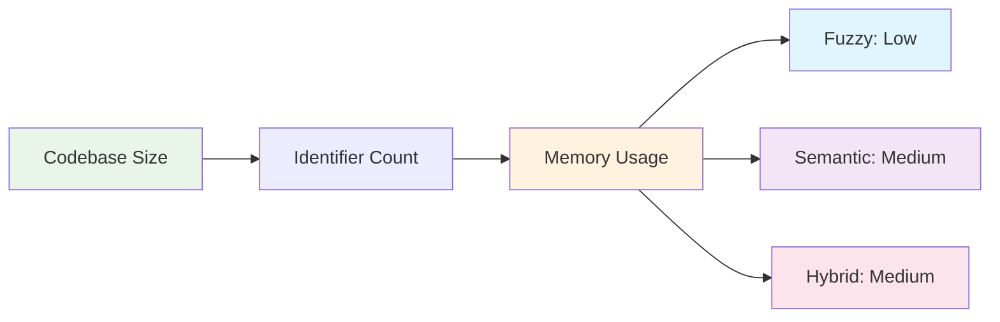

## 🔧 **Configuration Architecture**

### **Parameter Flow**

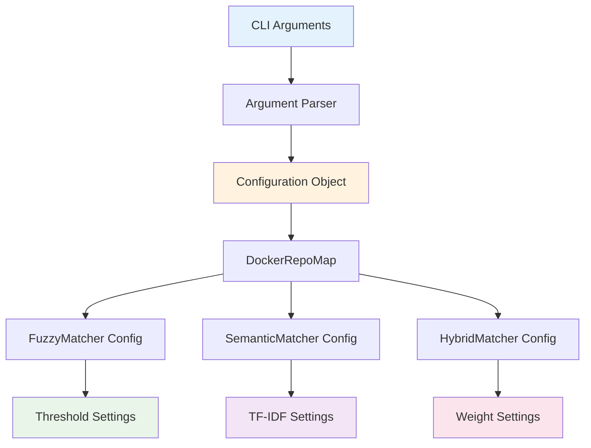

### **Default Configuration**

```yaml
# Fuzzy Matching Defaults
fuzzy_match: false
fuzzy_threshold: 70
fuzzy_strategies: ["prefix", "substring", "levenshtein"]

# Semantic Matching Defaults
adaptive_semantic: false
semantic_threshold: 0.1

# Hybrid Matching Defaults
hybrid_match: false
weight_fuzzy: 0.6
weight_semantic: 0.4

# General Settings
verbose: true
cache_results: true
```

## 🔄 **Integration Points**

### **With Aider Core**

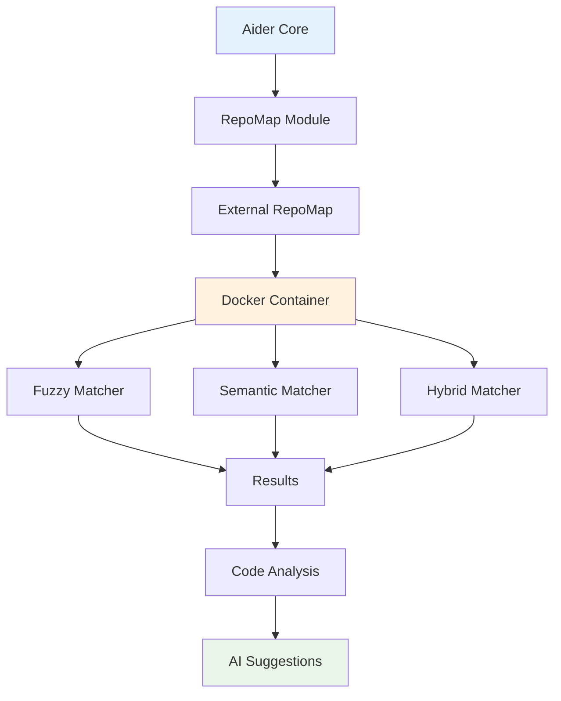

### **With Development Tools**

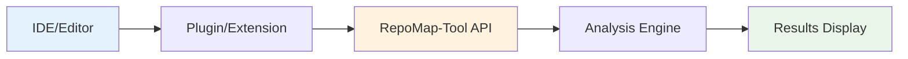

## 🚀 **Deployment Architecture**

### **Docker Container Structure**

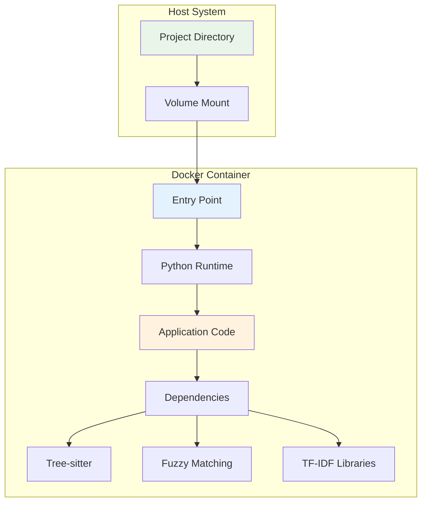

### **File Organization**

```
docker-repomap/
├── Dockerfile                 # Container definition
├── external_repomap.py       # Main application
├── fuzzy_matcher.py          # Fuzzy matching logic
├── adaptive_semantic_matcher.py  # Semantic matching logic
├── hybrid_matcher.py         # Hybrid matching logic
├── requirements.txt          # Python dependencies
├── build.sh                  # Build script
├── run.sh                    # Run script
└── README.md                 # Documentation
```

## 🔍 **Error Handling & Recovery**

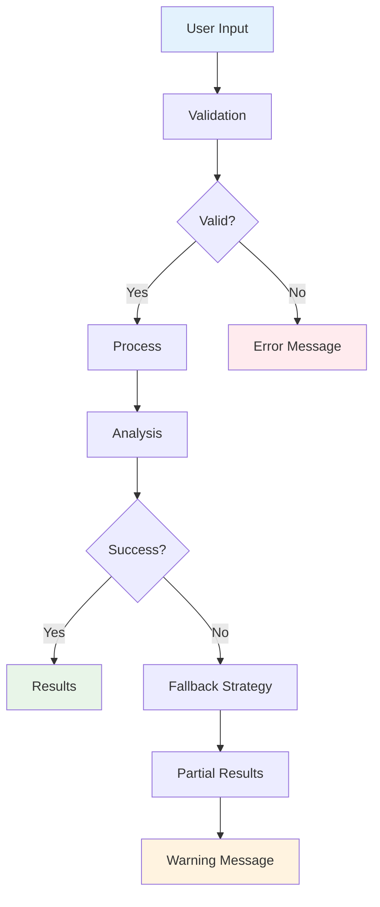

---

*This architecture provides a robust, scalable foundation for intelligent code analysis and discovery.*
