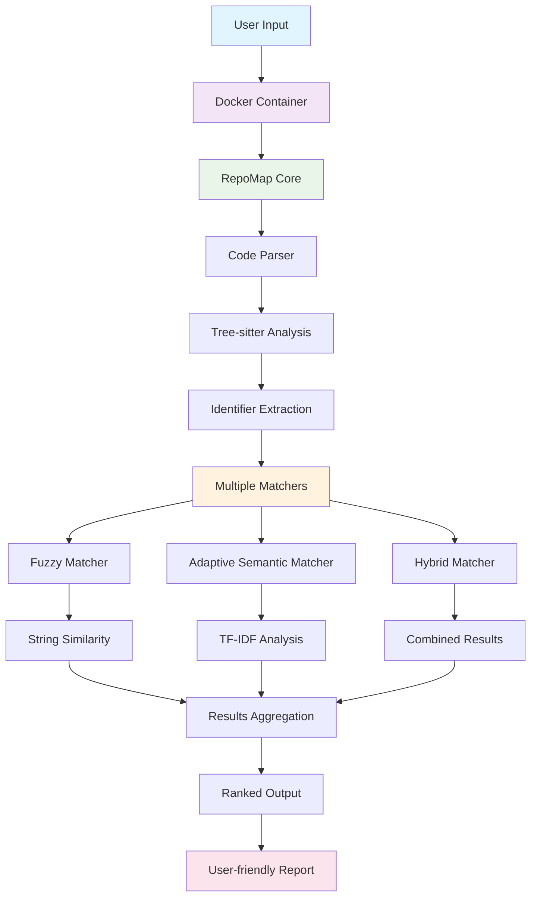
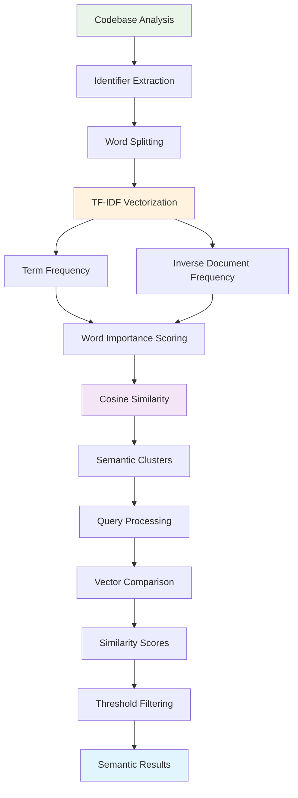
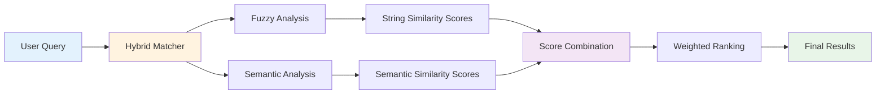
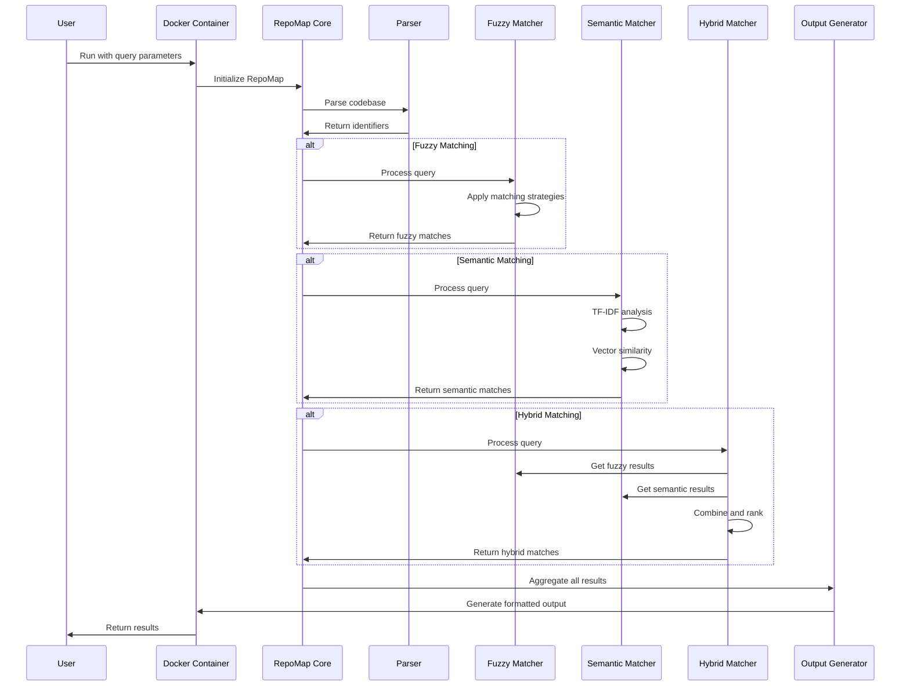
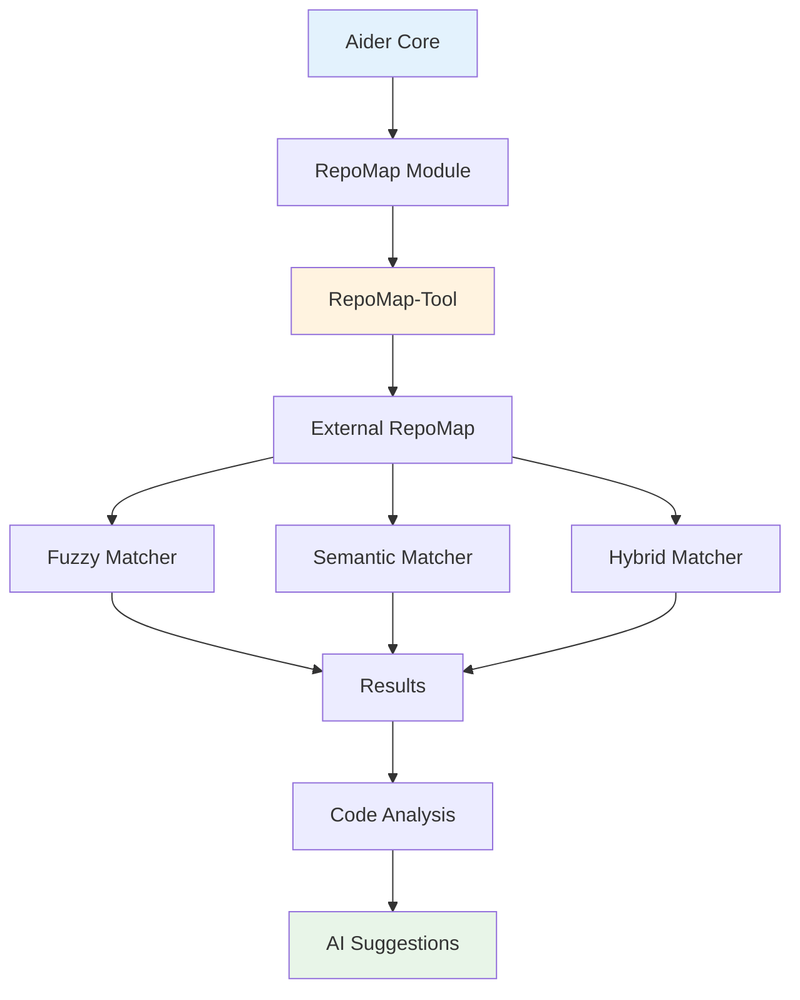
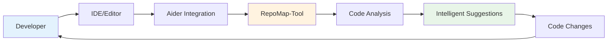

# RepoMap-Tool Integration: Complete System Overview

## 🎯 **What is RepoMap-Tool?**

RepoMap-Tool is a sophisticated code analysis tool that creates intelligent maps of your codebase. It combines multiple matching strategies to help you understand and navigate complex projects by finding related code elements.

## 🏗️ **System Architecture Overview**



## 🔍 **Matching Strategies Deep Dive**

### 1. **Fuzzy Matching Strategy**

```mermaid
graph LR
    A[Query: "auth"] --> B[Fuzzy Matcher]
    B --> C[Prefix Match]
    B --> D[Substring Match]
    B --> E[Levenshtein Distance]
    B --> F[Word Overlap]
    
    C --> G[authentication: 95]
    C --> H[auth_token: 90]
    D --> I[oauth_provider: 85]
    E --> J[authorize: 80]
    F --> K[user_auth: 75]
    
    G --> L[Score Filtering]
    H --> L
    I --> L
    J --> L
    K --> L
    
    L --> M[Ranked Results]
    
    style A fill:#e3f2fd
    style B fill:#fff3e0
    style M fill:#e8f5e8
```

**How it works:**
- **Prefix Matching**: Finds identifiers that start with your query
- **Substring Matching**: Finds identifiers containing your query
- **Levenshtein Distance**: Measures edit distance between strings
- **Word Overlap**: Finds identifiers with similar word patterns

### 2. **Adaptive Semantic Matching Strategy**



**How it works:**
- **TF-IDF Analysis**: Calculates word importance based on frequency
- **Vectorization**: Converts identifiers into numerical vectors
- **Cosine Similarity**: Measures semantic similarity between vectors
- **Adaptive Learning**: Learns from your actual codebase patterns

### 3. **Hybrid Matching Strategy**



**How it works:**
- **Combines both approaches** for maximum coverage
- **Weighted scoring** balances string and semantic similarity
- **Context-aware ranking** considers codebase patterns
- **Flexible thresholds** for different use cases

## 🔄 **Data Flow Diagram**



## 🎛️ **Configuration Options**

### **Fuzzy Matching Parameters**
```yaml
fuzzy_match: true
fuzzy_threshold: 70  # 0-100
fuzzy_strategies:
  - prefix
  - substring
  - levenshtein
  - word
```

### **Semantic Matching Parameters**
```yaml
adaptive_semantic: true
semantic_threshold: 0.1  # 0.0-1.0
```

### **Hybrid Matching Parameters**
```yaml
hybrid_match: true
fuzzy_threshold: 70
semantic_threshold: 0.3
weight_fuzzy: 0.6
weight_semantic: 0.4
```

## 📊 **Performance Comparison**

| Strategy | Speed | Accuracy | Flexibility | Use Case |
|----------|-------|----------|-------------|----------|
| **Fuzzy** | ⚡⚡⚡ | ⚡⚡ | ⚡⚡ | Exact string matching |
| **Semantic** | ⚡⚡ | ⚡⚡⚡ | ⚡⚡⚡ | Conceptual relationships |
| **Hybrid** | ⚡⚡ | ⚡⚡⚡ | ⚡⚡⚡ | Best overall coverage |

## 🚀 **Usage Examples**

### **Basic Fuzzy Matching**
```bash
docker run -v /path/to/project:/project repomap-tool /project \
    --mentioned-idents "auth,user,login" \
    --fuzzy-match \
    --fuzzy-threshold 70
```

### **Advanced Semantic Matching**
```bash
docker run -v /path/to/project:/project repomap-tool /project \
    --mentioned-idents "data processing,validation" \
    --adaptive-semantic \
    --semantic-threshold 0.2
```

### **Hybrid Approach**
```bash
docker run -v /path/to/project:/project repomap-tool /project \
    --mentioned-idents "api,config,settings" \
    --fuzzy-match \
    --fuzzy-threshold 60 \
    --adaptive-semantic \
    --semantic-threshold 0.15
```

## 🔧 **Integration Points**

### **With Aider Core**


### **With Development Workflow**


## 🎯 **Key Benefits**

1. **🔍 Intelligent Discovery**: Finds related code you might miss
2. **🎯 Context-Aware**: Understands your codebase patterns
3. **⚡ Fast Performance**: Cached results for quick iteration
4. **🔄 Flexible Matching**: Multiple strategies for different needs
5. **📊 Comprehensive Analysis**: Covers both exact and conceptual matches
6. **🛠️ Easy Integration**: Works with existing development tools

## 🔮 **Future Enhancements**

- **Machine Learning**: Learn from user feedback
- **Graph Analysis**: Visualize code relationships
- **Real-time Updates**: Watch for code changes
- **Multi-language Support**: Enhanced parsing for more languages
- **API Integration**: RESTful endpoints for external tools

---

*This integration provides a powerful foundation for understanding and navigating complex codebases through intelligent pattern recognition and semantic analysis.*
